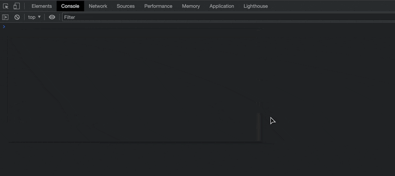

# Web Extension Require

An extension to require npm packages in browser dev-tools.

  

## Usage

1. [Download](https://github.com/kricsleo/webext-require/releases) this extension and install it on the [extension](chrome://extensions/) page.
2. Use `_require` in dev-tools to install packages from npm.

Packages must provide 'UMD' or other browser format bundles so that they can be directly used in the browser.
